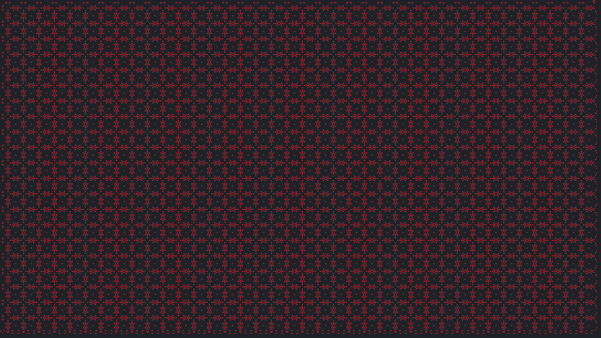
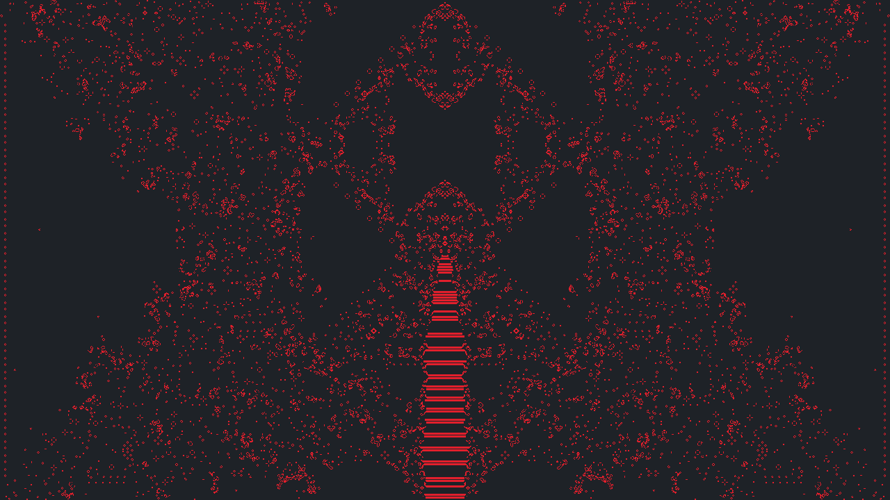
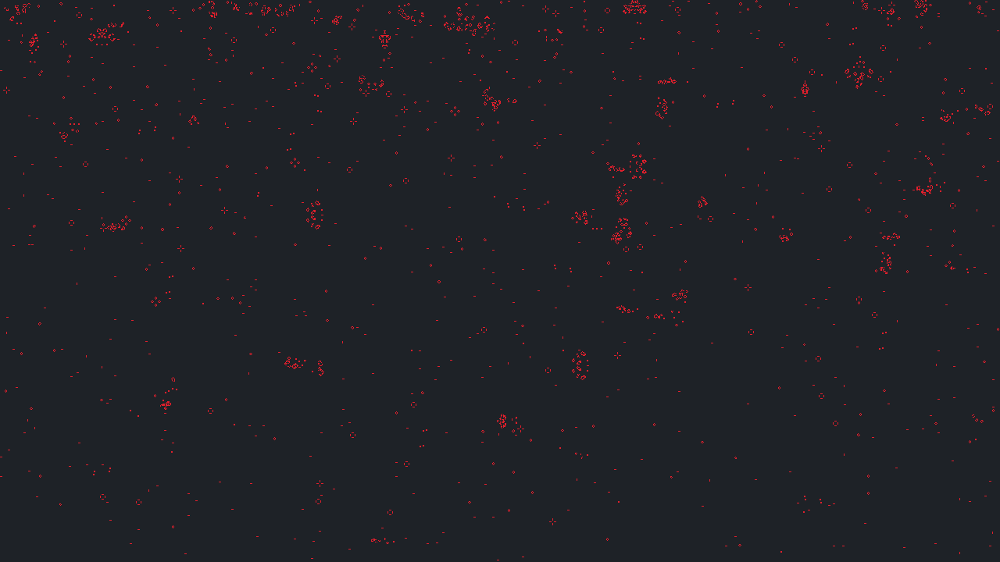
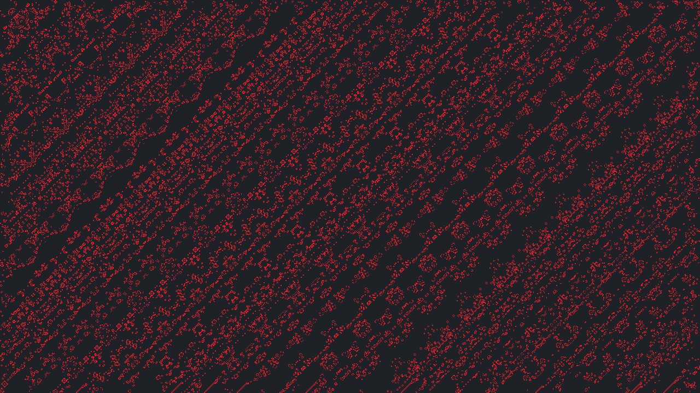
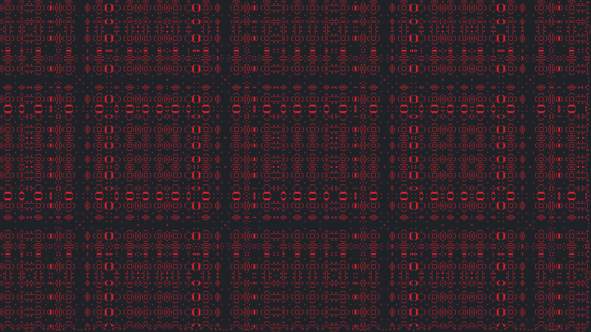
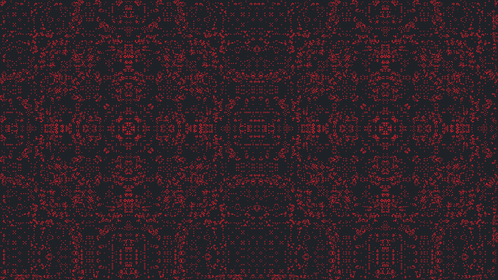

# GameOfLife

    O Jogo da Vida de Conway é um autômato celular simples e que simula a evolução de células em um array bidimensional. Foi inventado pelo matemático britânico John Conway em 1970.

Cada uma das células no array pode estar viva ou morta. Em cada etapa do jogo, a evolução das células é determinada pelas células vizinhas de acordo com as seguintes regras:

1. Uma célula viva com menos de dois vizinhos vivos morre de solidão.
2. Uma célula viva com dois ou três vizinhos vivos continua viva.
3. Uma célula viva com mais de três vizinhos vivos morre de superpopulação.
4. Uma célula morta com exatamente três vizinhos vivos se torna viva.

---

# Requirements

~~~python
llvmlite==0.39.1
numba==0.56.4
numpy==1.23.5
Pillow==9.4.0
pygame==2.1.3
~~~

~~~python
pip install -r requirements.txt
~~~

# Funcionamento
 
Este programa implementa o Jogo da Vida em um array bidimensional de tamanho `1280x720` onde cada célula tem 1 de largura e altura. Ao todo, o programa disponibiliza 9 padrões pré-definidos para preencher inicialmente o grid, após preencher o grid, é possível visualizar a evolução das células. As bibliotecas `numpy` e `numba` foram utilizadas na otimização da solução e o `pygame` foi utilizado para a visualização da evolução das células.

 > Pressione `s` para tirar uma captura de tela, as capturas serão salvas na pasta `screenshots` dentro da pasta principal do programa.
 >
 > Pressione `z` para reiniciar o padrão.
 >
 > Pressione os digitos `1 a 9` para escolher o padrão.
 >
 > Pressione `space` para pausar/iniciar a execução do padrão.
 >
 >Execute o arquivo `main.py` para jogar.

# Padrões após algumas gerações

#### 1

#### 2

#### 3

#### 4

#### 5

#### 6

#### 7

#### 8

#### 9

