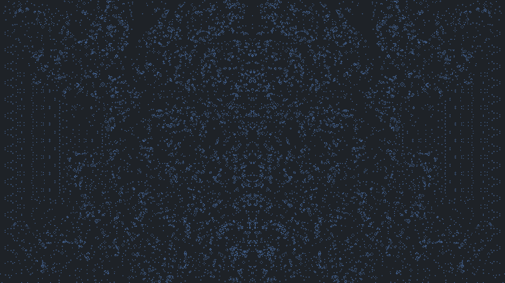

# GameOfLife

    O Jogo da Vida de Conway é um autômato celular simples e que simula a evolução de células em um array bidimensional. Foi inventado pelo matemático britânico John Conway em 1970.

Cada uma das células no array pode estar viva ou morta. Em cada etapa do jogo, a evolução das células é determinada pelas células vizinhas de acordo com as seguintes regras:

1. Uma célula viva com menos de dois vizinhos vivos morre de solidão.
2. Uma célula viva com dois ou três vizinhos vivos continua viva.
3. Uma célula viva com mais de três vizinhos vivos morre de superpopulação.
4. Uma célula morta com exatamente três vizinhos vivos se torna viva.

As células são atualizadas simultaneamente em cada etapa do jogo. As regras simples de evolução levam a uma grande variedade de padrões complexos, incluindo estruturas estáveis, osciladores e naves espaciais.

---

> Execute o arquivo main.py para jogar.
> 
> Requirements:
> 
> - llvmlite==0.39.1
> 
> - numba==0.56.4
> 
> - Pillow==9.4.0
> 
> - pygame==2.1.3

# Implementação

 Alem da lógica de próxima geração e visualiação das células em uma janela gráfica, a possibilidade de salvar uma captura de tela e pausar/resetar o jogo também foram implementadas. 

# Otimização

    As bibliotecas **numba**  e **numby** foram utilizadas para melhorar a performance do jogo, com elas é possível utilizar um grid com 720 linhas e 1280 colunas (921.600 células) e obter resultados satisfatórios de processamento.

# Padrões

    Ao todo, 9 padrões estão disponíveis para esta implementação, eles podem ser selecionados apertando as teclas 1 à 9 no teclado. 

### Exemplos dos padrões após algumas gerações

#### Padrão 1

#### Padrão 2

#### Padrão 3

#### Padrão 4

#### Padrão 5

